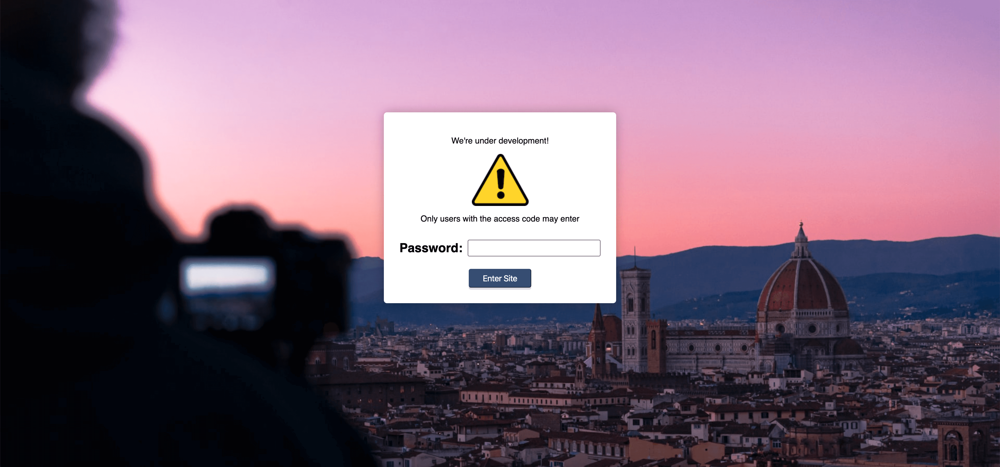

# React-Child-Lock

> Add a simple lock to prevent your site from being accessed by users while under development

[](https://www.npmjs.com/package/react-child-lock) [](https://standardjs.com)

## Description
React-Child-Lock is a simple & customizable way of preventing un-wanted users from visiting your site. This library is in no way secure as the password is simply passed as a prop, hence the name *child lock*. Please do not use this library to restrict access to confidential/secure information. The intent of this is to prevent users from acessing a project under development and thinking it's a finished product.



## Install

```bash
npm install --save react-child-lock
```

## Usage
### ChildLock
> This the easiest way to get started, which uses the default password; ```Password```.

```jsx
import React from 'react';
import ChildLock from 'react-child-lock';

export default function App() {
    return (
        <div className="app">
            <ChildLock/>
            // Rest of your code goes here
        </div>
    )
}
```

### Customization
> React-Child-Lock can be customized by passing the following **optional** props

- **password**: A ```string``` containing the password you wish to use.
- **localStorage**: A ```boolean``` for whether or not to use localStorage to save the password locally on the device. If ```true``` the user will only have to enter the password once (*defaults to ```false```*).
- **customContent**:
- **background**:
- **inputLabelText**: A ```string``` containing the text for the input label (*defaults to ```"Password:"```*).
- **buttonText**:
- **errorText**:

## License

MIT © [Jordan-Morrison](https://github.com/Jordan-Morrison)
